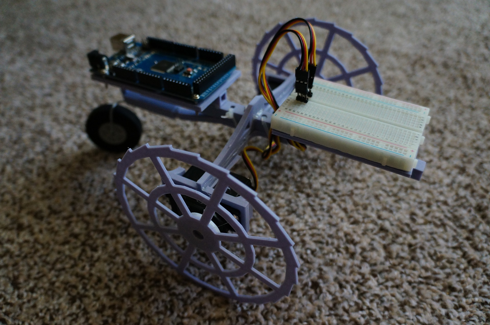
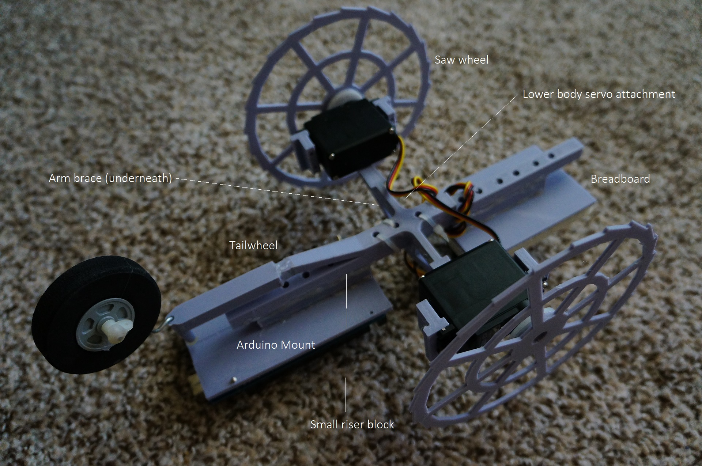
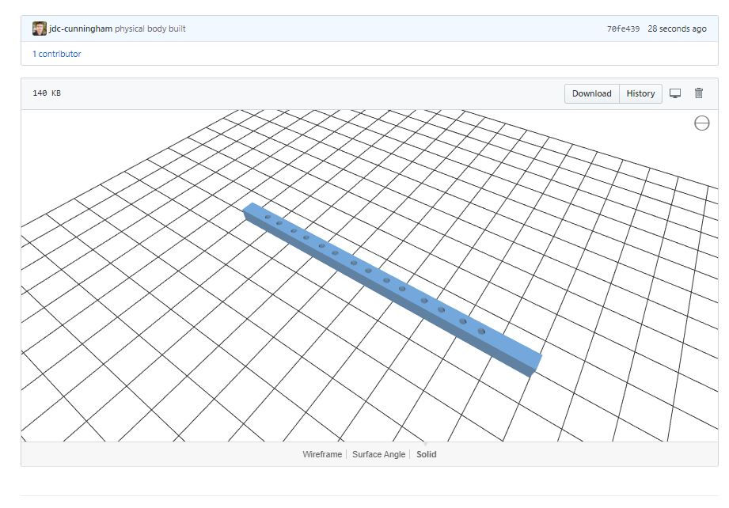

##### Please note:

This thing is a piece of crap. I just threw something together over a weekend so I had a physical body to work with. But here are the files and a link to this blog post I wrote about this which is more a collection of thoughts rather than anything like a tutorial. This is also currently not complete as of 11/10/2019. It is intended as a base paltform(for me) to attach sensors to and develop an ultrasonic-based "SLAM" mapping robot. And while we're at it, throw in solar-powered self-contained magic. That is the end goal but it won't be this robot.

### Blog Entry more details
[View Story](https://github.com/jdc-cunningham/noob-robotics/tree/master/taildragger-ultrasound-mapping)

### Materials
* Arduino Mega 2560
* HSR-1425CR (2x)
* Breadboard
* 3D Printer(Ender Pro 3)
* PLA (Gray 1.75mm)

### Other materials
* Wheel
* Bendable metal rod(2mm)
* Hot glue/super glue

I have ordered two separate battery packs. I'm sticking with NiCds for now as I think they're "safer" to use vs. Li-Ions(balancing). I have a balancer charger but yeah... One for the Arduino itself/sensors 9.6v 8-cell and then one for the servos 7.2v 6-cell.

Initially there was this flimsy arm and I didn't realize how flimsy it was(still getting used to visualizing metric units and 3d modeling) so I added this brace that goes over the center spine/arms.

### Design considerations
This is meant for a carpet too, the "saw-wheels".

### Mistake
The part of the tail wheel that slides over the bent part of the "low-arm control" is too small or rather the bent part from the lower-body-servo-attachment is too big so it doesn't slide into the tail wheel assembly. I had to take a razor to file that down.

### Progress
* 11/10/2019
  * At this time only the body is complete. I ordered parts for power so it doesn't have to be plugged in. I'm a noob in Arduino/Robotic programming "paradigm" so it will probably suck. But I will get it to move/have avoidance. Then eventually move onto more complex stuf like SLAM and knowing where a solar source is(window) to recharge(hilarious). This is a building block to an outdoor robot project which if I'm still alive/not homeless I will build.
  * real talk, this STL realtime viewer built into Github... mad cool
  
